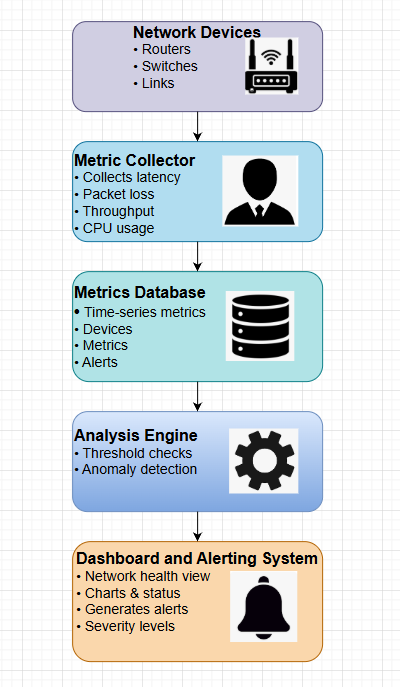

# System Architecture

## Overview
The Telecom Network Monitoring System is designed to continuously monitor telecom network devices, collect performance metrics, analyze network health, and alert operators about potential issues before service degradation occurs.

The system follows a modular and scalable architecture similar to real-world Network Operations Center (NOC) monitoring platforms.

## Architecture Diagram

## Architecture Components

### 1. Network Devices
This layer represents telecom infrastructure components such as:
- Routers
- Switches
- Network links

These devices generate operational metrics including latency, packet loss, throughput, and CPU utilization.

---

### 2. Metric Collector
The Metric Collector is responsible for:
- Periodically collecting metrics from network devices
- Normalizing metrics into a standard format
- Forwarding collected data to the metrics database

This component simulates real-time telemetry collection used in telecom networks.

---

### 3. Metrics Database
The Metrics Database stores:
- Time-series network metrics
- Device information
- Alert history

It is optimized for frequent writes and efficient querying of historical data for analysis and visualization.

---

### 4. Analysis Engine
The Analysis Engine continuously processes incoming metrics to:
- Perform threshold-based checks
- Detect anomalies in network behavior
- Identify potential faults and performance degradation

This enables proactive network monitoring.

---

### 5. Dashboard and Alerting System
This component provides:
- Real-time network health visualization
- Charts and status indicators
- Alert generation with severity levels

Alerts help network operators quickly respond to issues and minimize downtime.

---

## Data Flow Summary
1. Network devices generate metrics
2. Metrics are collected by the metric collector
3. Data is stored in the metrics database
4. Analysis engine evaluates network health
5. Dashboard displays insights and generates alerts

## Design Considerations
- Modular architecture for scalability
- Separation of concerns between data collection, storage, and analysis
- Real-time and proactive monitoring approach
